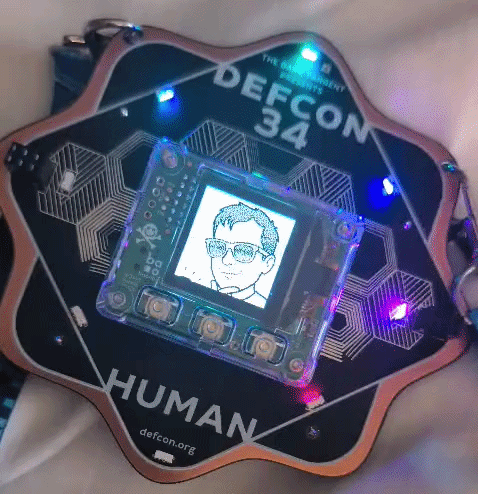
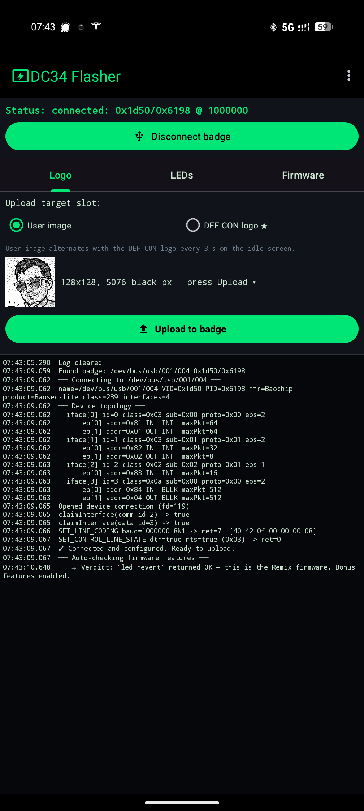
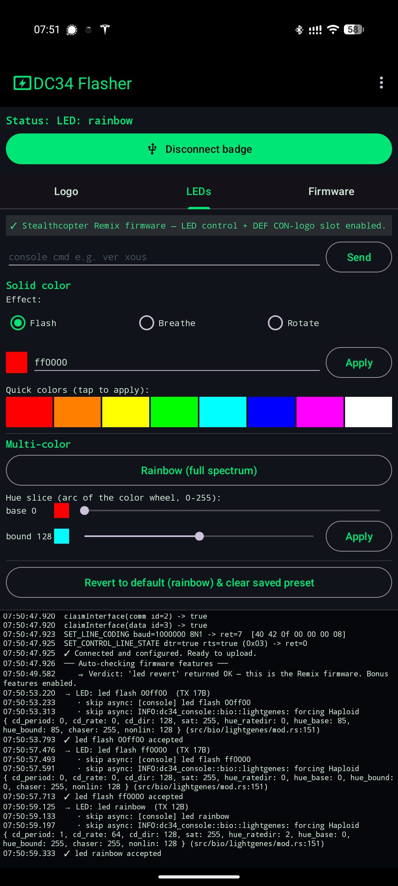

# DC34 badge - custom firmware + companion Android app

  

Personal fork of the Defcon 34 badge firmware, plus a matching Android app to drive
it over USB.

- `firmware/` - the badge firmware (vendored monorepo). See `firmware/README.md` for
  build instructions.
- `android/` - the companion Android app. Talks to the badge over USB-serial.

  
  &nbsp;
  

## Installing

**Minimum path:** install the [Android app](https://github.com/stealthcopter/defcon-34-badge-stealthcopter-remix/releases/latest/download/app-release.apk), plug the badge into your phone, and let
the app download the pre-compiled firmware bundle and flash it for you. That's it,
you don't need any of the source in this repo.

Everything else in this repo is optional and only relevant if you want to build
things yourself:

- Build the firmware from source, see `firmware/README.md`. Output is three
  `.uf2` files you can copy onto the badge in mass-storage mode manually if you'd
  rather not use the app.
- Build the Android app from source, see `android/README.md` (if present) or the
  project files under `android/`.

Everything's a bit rough around the edges, it was thrown together at
hackathon-speed, but the moving parts should be self-explanatory. If something
doesn't work, the source is right here to poke at.

## What this adds on top of upstream

- **Replaceable Defcon-logo image**, uploadable over USB just like the existing user
  image (`imagedc …` REPL command, mirrors `image`).
- **LED preset control** over USB: `led rainbow` / `led solid <RRGGBB>` /
  `led hue <base> <bound>` / `led force <32-hex>` / `led revert`. Also fixes an
  upstream bug where `LedManagerOp::Force` was silently discarded by the BIO
  coprocessor (missing `0x40000000` codon bit).
- **Always-on display**, disables the idle screen-off timeout and fade.
- **DEV MODE overlay hidden**, the on-screen text is suppressed for self-loaded
  firmware. (The developer-mode state itself is a one-way hardware counter and
  cannot be undone.)
- **Default LED pattern set to rainbow** via a `Diploid::phenotype()` override, so
  a fresh boot / QR-code mating always renders rainbow instead of a mated
  gene-derived pattern.
- **Stealthcopter logo baked in** as the fallback Defcon-slot image (used until
  `imagedc` uploads a replacement).
- **Log spam quieted**: keyboard-input-overflow lines demoted from `info!` to
  `debug!` so fast image uploads don't drown the log.

## Upstream

Firmware is derived from these repos (all vendored into `firmware/` with their
`.git` directories removed, no submodules):

- [bunnie/dc34-vault](https://github.com/bunnie/dc34-vault), the badge application
- [bunnie/dc34-console](https://github.com/bunnie/dc34-console), on-badge REPL, LED + power servers
- [bunnie/dc34-api](https://github.com/bunnie/dc34-api), shared API types
- [betrusted-io/xous-core](https://github.com/betrusted-io/xous-core), Xous OS,
  services, HAL, `xtask` build system

## Known issues

**Phone on-screen keyboard doesn't show up while the badge is connected.** The
badge does something funky with the USB keyboard descriptor: while it's plugged
into your phone, Android sometimes decides "there's already a physical keyboard
here, don't show the soft one" and hides the on-screen keyboard for every text
field system-wide. Not this app's fault, it's the badge's HID advertisement.
Workaround: unplug the badge to type, or in Android Settings → System →
Languages & input → Physical keyboard, turn on "Show on-screen keyboard" while a
physical keyboard is connected.

**"DEV MODE" text on the idle screen after re-flashing original firmware.**
Flashing any self-built firmware (including this one) trips the badge's hardware
`DEVELOPER_MODE` one-way counter. That counter is **physically monotonic**, it
can be incremented but never reset, so re-flashing the *original* signed firmware
from bunnie's release will still render a **"DEV MODE"** overlay on the idle
screen. This is a silicon-level tamper flag; there is no software or button-combo
that clears it. If the overlay bothers you on stock firmware, it's a trivial
~15-line source diff to hide the text (same edit this fork already ships): remove
the `if mode_at_entry == VaultMode::IdleDevMode { … "DEV MODE" … }` block from
`src/ux.rs` in [bunnie/dc34-vault](https://github.com/bunnie/dc34-vault),
rebuild, flash. Nothing else needs to change; signature validation and everything
downstream of `is_developer()` still works normally.

## Disclaimer

I take no responsibility if flashing this bricks your badge. (I don't think it
would, the badge has a mass-storage bootloader you can re-enter by holding a
button at plug-in, and re-flashing the upstream firmware should always work, but
you're on your own if something goes sideways.)
